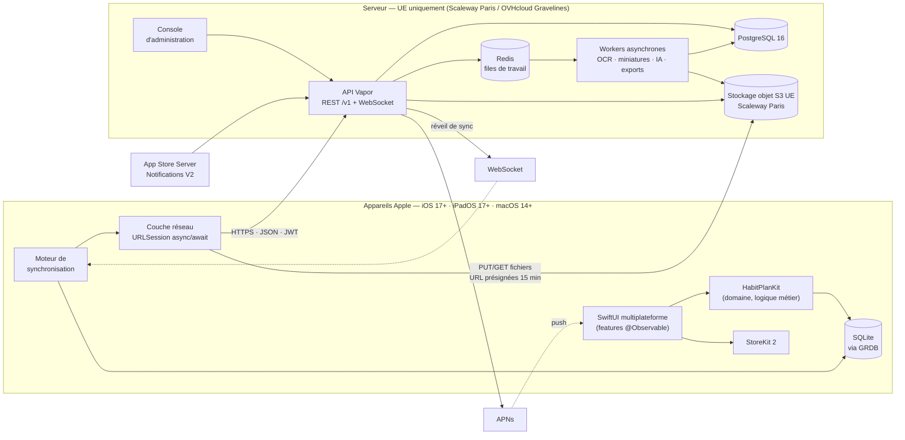

# Habit Plan — 06 · Architecture technique

> Ce document détaille l'architecture décrite en synthèse dans
> `00-fondations.md` (§3). En cas de divergence, `00-fondations.md` prévaut.
> Documents liés : `07-modele-de-donnees.md` (schéma), `08-api-endpoints.md`
> (API), `09-synchronisation.md` (protocole de sync).

---

## 1. Vue d'ensemble

Trois principes structurent l'architecture :

1. **Offline-first** — la base SQLite locale est la source de vérité de
   l'interface ; le serveur est un point de convergence, pas un préalable.
2. **Un seul langage** — Swift du client au serveur (Vapor), un modèle de
   domaine partagé conceptuellement (mêmes noms, mêmes conventions).
3. **API neutre** — l'API REST `/v1` ne présuppose rien du client : elle
   servira telle quelle un futur client web ou Android.



Le client ne parle qu'à deux hôtes : l'API (JSON) et le stockage objet
(fichiers, exclusivement via URL présignées à durée courte — jamais d'URL
publique permanente, cf. `00-fondations.md` §8).

---

## 2. Côté client

### 2.1 Application SwiftUI multiplateforme

- **SwiftUI exclusivement**, Swift 5.10, une **cible unique** iOS + macOS
  générée par **XcodeGen** (`app/project.yml`). Pas de storyboard, pas d'UIKit
  hors ponts ponctuels (`UIViewRepresentable` pour RoomPlan).
- Navigation : `TabView` sur iPhone, `NavigationSplitView` (sidebar) sur iPad
  et Mac. Les destinations sont des valeurs (`Hashable`) routées par un
  routeur observable par feature.
- Graphiques budget/avancement : **Swift Charts**. Chiffres financiers en
  `.monospacedDigit()` (cf. `00-fondations.md` §2).

### 2.2 HabitPlanKit — le package de domaine

Package Swift local, sans dépendance UI, qui contient :

| Module | Contenu |
|---|---|
| `Models` | Les 27 entités (`VaultDocument`, `ProjectTask`, `FloorPlan`, `NotificationItem`… — nommage canonique §5 de `00-fondations.md`), enums de statuts, `Money` (centimes + devise), `VATRate` (`vatRateBps`) |
| `Logic` | Calculs métier purs : totaux HT/TVA/TTC, avancement projet, échéances, règles de rôle |
| `SampleData` | Jeu « Maison des Lilas » (prototype, previews, tests, captures) |

Tout ce qui est testable sans écran vit ici ; la couverture de tests se
concentre sur ce package.

### 2.3 Persistance locale — GRDB / SQLite

- **GRDB** au-dessus de SQLite : migrations versionnées, `ValueObservation`
  pour piloter SwiftUI, requêtes typées, WAL activé.
- Une base par utilisateur connecté (`habitplan-<userId>.sqlite`), protégée
  par la Data Protection d'iOS/macOS (classe *complete until first user
  authentication*).
- Schéma local aligné sur le schéma serveur (`07-modele-de-donnees.md`) :
  mêmes noms de colonnes en camelCase, mêmes UUID v7, plus les colonnes
  propres à la sync locale (`pending_changes`, curseurs, états de fichier).
- Le prototype utilise un store en mémoire ; GRDB est la cible de la V1.

### 2.4 Moteur de synchronisation

Résumé (protocole complet dans `09-synchronisation.md`) :

- Chaque écriture locale est jouée en transaction : mutation de la table
  métier **et** insertion dans le journal `pending_changes`.
- **Push par lots** vers `POST /v1/sync/push` ; **pull incrémental** par
  curseur via `GET /v1/sync/pull?cursor=`.
- Fusion **LWW champ par champ** ; copies de conflit pour les fichiers ;
  suppressions propagées par **tombstones** (`deletedAt`) ; jamais
  d'écrasement silencieux.
- Déclencheurs : ouverture d'app, écriture locale (debounce), notification
  WebSocket, push silencieux APNs, retour de réseau.
- Fichiers (documents, photos, scans) envoyés **en différé** via URL
  présignées, avec reprise et état visible (« fichier en attente »).

### 2.5 Couche réseau

- `URLSession` + **async/await**, sans dépendance tierce.
- Un client `APIClient` typé : `Endpoint` (méthode, chemin `/v1/...`, corps
  `Encodable`), décodage `Decodable` avec dates ISO 8601, erreurs mappées
  depuis RFC 7807 (`08-api-endpoints.md` §1).
- Authentification : JWT court (15 min) en mémoire, refresh token rotatif
  dans le **Keychain** ; rafraîchissement transparent avec file d'attente des
  requêtes pendant le refresh.
- **Idempotency-Key** (UUID v7) posée automatiquement sur tout POST rejouable.
- Transferts de fichiers en tâche `background` (`URLSessionConfiguration
  .background`) pour survivre aux suspensions d'app.

### 2.6 StoreKit 2

- Produits : Premium mensuel, Premium annuel, Famille (chiffres canoniques
  `00-fondations.md` §6), essai 14 jours.
- Achat et état local via StoreKit 2 (`Transaction.currentEntitlements`) ;
  **la vérité serveur** vient des App Store Server Notifications V2 reçues
  par l'API (`08-api-endpoints.md` §9), qui alimentent l'entité
  `Subscription`.
- Dégradation douce : après expiration, **lecture et export garantis à vie** ;
  les quotas gratuits redeviennent bloquants uniquement pour la création.

### 2.7 Capture et intelligence embarquée (V3)

- **RoomPlan / ARKit / RealityKit** : scan LiDAR des pièces → `RoomScan`
  (USDZ), assemblage en `FloorPlan`. Avertissement systématique : mesures à
  vérifier avant commande de matériaux (`00-fondations.md` §8).
- **Vision / VisionKit** : OCR embarqué (détection de texte sur devis et
  factures) pour un premier remplissage **hors ligne**, complété côté serveur
  par la file d'analyse (opt-in, cf. §3.3).
- **Core ML** : classification embarquée de documents (facture / devis /
  garantie / diagnostic) et suggestions de catégorie de dépense. Tout
  résultat est une **proposition à valider**, jamais appliqué seul.

### 2.8 Architecture par « features »

```
app/Sources/
  Features/
    Dashboard/   Projects/   Budget/   Vault/      ← documents
    Rooms/       Contractors/ Equipment/ Settings/  …
  Shared/        ← composants UI, thème (palette §2), formatters
  Services/      ← APIClient, SyncEngine, StoreService, PushService
```

- Chaque feature = vues SwiftUI + un modèle **`@Observable`** (macro
  Observation) qui expose l'état et les intents ; pas de framework
  d'architecture tiers.
- Les modèles de feature dépendent de protocoles (`ExpenseRepository`,
  `SyncScheduling`…) injectés via l'`Environment` — implémentations GRDB en
  production, en mémoire pour previews et tests.
- Règle : **aucune** logique métier dans les vues ; les calculs vivent dans
  `HabitPlanKit.Logic`.

---

## 3. Côté serveur

### 3.1 API Vapor (Swift) — choix et alternative

**Choix : Vapor 4 (Swift, SwiftNIO).**

| Argument | Détail |
|---|---|
| Cohérence de langage | Une seule expertise Swift pour toute l'équipe ; les conventions (Codable, enums de statut, `Money`) se traduisent sans friction |
| Modèle partagé | Les DTO `/v1` sont relus contre les types de `HabitPlanKit` (mêmes noms camelCase, mêmes unités en centimes) |
| Performances | SwiftNIO, non bloquant, async/await natif ; largement suffisant pour une charge CRUD + files |
| Typage fort | Erreurs de contrat détectées à la compilation des deux côtés |

**Alternative documentée : NestJS (TypeScript).** À retenir si l'équipe
serveur devient majoritairement web : écosystème plus vaste (ORM, files,
observabilité), recrutement plus facile, meilleure synergie avec un futur
client web. Coût : duplication du modèle de domaine et discipline de contrat
(OpenAPI générée et testée) pour compenser la perte du typage partagé.
La décision est **réversible tant que l'API reste le seul contrat** : aucun
client ne dépend d'autre chose que de `/v1`.

Structure Vapor : contrôleurs par ressource, middlewares (auth JWT, rôles,
Idempotency-Key, quotas), services (S3, APNs, files), migrations Fluent —
ou SQL explicite pour les requêtes de sync, sensibles à l'index.

### 3.2 PostgreSQL 16

- Schéma détaillé dans `07-modele-de-donnees.md` : UUID v7 en clés primaires,
  montants en centimes (`bigint`), `vatRateBps` (`int`), soft delete
  `deletedAt`, `syncVersion` par ligne.
- Index systématiques sur `(propertyId, updatedAt)` — c'est la requête de
  pull incrémental — et sur les FK.
- Sauvegardes **pgBackRest** chiffrées (complètes + WAL, PITR), testées par
  restauration mensuelle en staging.

### 3.3 Redis — files de travail et workers

Redis porte les **files** (et uniquement cela : pas de données durables) :

| File | Travail | Déclencheur |
|---|---|---|
| `thumbnails` | Miniatures et aperçus (photos, PDF, USDZ) | Fin d'upload S3 |
| `ocr` | OCR serveur des documents | `POST /v1/documents/{id}/analyze` (**consentement explicite requis**) |
| `analysis` | Extraction structurée (montants, TVA, échéances) et comparaison de devis — résultats toujours **proposés à validation** | Fin d'OCR |
| `exports` | Exports ZIP/PDF, export RGPD | `POST /v1/exports`, `POST /v1/account/export` |
| `push` | Envoi APNs et notifications | Événements métier |
| `purge` | Purges différées 30 j (corbeille, logements, comptes) | Planificateur quotidien |

Les **workers** sont le même binaire Vapor lancé en mode `queues`, déployés
séparément de l'API (mise à l'échelle indépendante). Chaque tâche est
idempotente et rejouable ; échecs → nouvelle tentative avec backoff, puis
file morte visible dans la console d'admin.

### 3.4 Stockage objet S3 — Scaleway (Paris)

- Buckets par environnement (`habitplan-prod`, `-staging`, `-dev`),
  **versioning activé** (versions de documents, protection contre
  l'écrasement), chiffrement au repos, région **fr-par** exclusivement.
- Clés préfixées par compte et logement :
  `properties/{propertyId}/documents/{documentId}/{version}` — la purge d'un
  logement est un balayage de préfixe.
- Accès client **uniquement** par URL présignées 15 min (upload comme
  téléchargement), délivrées par l'API après contrôle de rôle.
- **Quotas** : 1 Go (gratuit) / 50 Go (Premium) comptabilisés dans
  PostgreSQL à chaque `complete` d'upload ; dépassement → 402/413 propre à
  la création, jamais de blocage en lecture.

### 3.5 APNs et WebSocket de sync

- **APNs** (jeton p8) : notifications visibles (invitations, échéances,
  rappels d'entretien, fin d'analyse) et **push silencieux** de réveil de
  sync ; registre `Device` avec révocation.
- **WebSocket** `GET /v1/sync/socket` : canal léger authentifié qui ne
  transporte **aucune donnée métier** — seulement « quelque chose a changé
  sur le logement X » ; le client déclenche alors un pull normal. En son
  absence (Mac fermé, réseau restreint), le push silencieux et le pull
  périodique prennent le relais.

### 3.6 Console d'administration et quotas

Application interne (accès restreint, SSO équipe, journalisée dans
`ActivityLog` administrateur) : recherche de compte, état d'abonnement,
quotas et usage, files et tâches en échec, tombstones et purges planifiées,
outils support (renvoi d'e-mail de vérification, déblocage). **Aucun accès
au contenu des documents** ; métadonnées seulement.

---

## 4. Environnements

| | dev | staging | prod |
|---|---|---|---|
| API | `api.dev.habitplan.app` | `api.staging.habitplan.app` | `api.habitplan.app` |
| Base | Postgres local / éphémère | Scaleway, jeu « Maison des Lilas » | Scaleway Paris, HA |
| S3 | bucket `-dev` | bucket `-staging` | bucket `-prod` (versioning + rétention) |
| APNs | sandbox | sandbox | production |
| App Store | build locale (XcodeGen) | TestFlight | App Store |
| Données | fictives | fictives uniquement | réelles — **jamais copiées ailleurs** |

Configuration par variables d'environnement ; secrets dans le gestionnaire
de secrets de l'hébergeur, jamais dans le dépôt.

## 5. CI/CD

**Apps (Xcode Cloud)** — à chaque PR : génération XcodeGen, build iOS + macOS,
tests `HabitPlanKit` puis tests UI ; sur `main` : build signée → TestFlight
interne ; sur tag `app/v*` : TestFlight externe puis App Store (validation
manuelle).

**Serveur (GitHub Actions)** — à chaque PR : lint (SwiftFormat/SwiftLint),
build Linux, tests avec Postgres 16 + Redis en services, test des migrations
(montée **et** descente) ; sur `main` : image Docker (multi-stage, image
finale minimale) → registre → déploiement **staging** automatique ; sur tag
`server/v*` : déploiement **prod** avec approbation, migrations exécutées
avant bascule, rollback = image précédente + migrations réversibles.

## 6. Observabilité

- **Logs structurés** JSON (`swift-log`) : `requestId` (propagé au client via
  en-tête), `userId`, `propertyId`, route, durée, statut. Jamais de contenu
  de document ni de jeton dans les logs.
- **Métriques** Prometheus (`swift-metrics`) : latence p50/p95/p99 par route,
  taux d'erreur, profondeur des files et âge du plus vieux job, durée des
  jobs OCR/miniatures, connexions WebSocket, écart de réplication Postgres,
  usage stockage par tranche.
- **Alerting** (Grafana/Alertmanager) : 5xx > 1 % sur 5 min, p95 > 800 ms,
  file OCR > 15 min de retard, échecs APNs anormaux, espace disque,
  certificats, échec de sauvegarde pgBackRest.
- Traces (OpenTelemetry) sur les chemins critiques : push/pull de sync,
  chaîne upload → miniature → OCR → analyse.
- Journal d'audit applicatif : `ActivityLog` (métier) + journal admin séparé.

## 7. Extension future — web et Android

L'extension est **permise par construction**, sans travail préparatoire
supplémentaire :

- L'API `/v1` est **neutre** : JSON camelCase, REST, aucune sémantique
  Apple en dehors des routes explicitement dédiées (`/v1/auth/apple`,
  `/v1/subscriptions/app-store-notifications`) — chacune doublable
  (auth e-mail déjà présente ; Google Play Billing s'ajouterait en
  parallèle sans toucher aux ressources métier).
- Le protocole de sync (lots, curseur, LWW champ par champ, tombstones)
  n'a rien de spécifique à GRDB : un client Android (Room/SQLDelight) ou
  web (IndexedDB, ou web « en ligne seulement » au début) l'implémente tel
  quel.
- Les fichiers passent par des URL présignées standard S3.
- Seuls StoreKit 2, RoomPlan/ARKit et VisionKit sont non portables — ils
  sont confinés au client et n'apparaissent pas dans le contrat d'API
  (un `RoomScan` est un fichier USDZ + métadonnées, quel que soit l'outil
  qui l'a produit).
