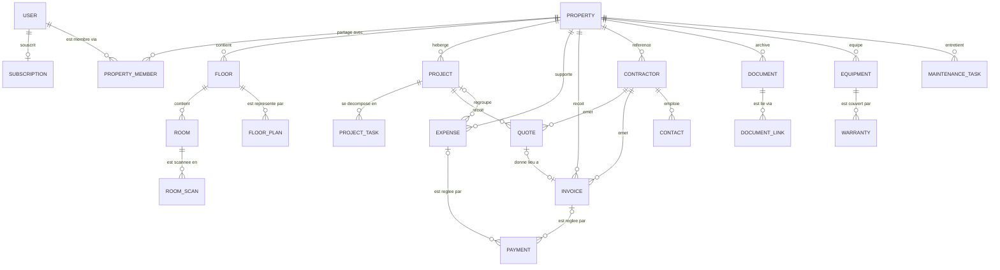

# Habit Plan — 07 · Modèle de données

> Détail des **27 entités** canoniques de `00-fondations.md` §5. Conventions
> (canoniques, §4) : UUID **v7 générés côté client**, montants en **centimes**
> (`amountHT` / `amountVAT` / `amountTTC` en `bigint`), TVA en points de base
> (`vatRateBps` en `int`), dates `timestamptz` UTC, soft delete `deletedAt`.
> Colonnes en camelCase, identiques dans l'API `/v1` et dans SQLite local.

---

## 1. Champs communs de synchronisation

Toutes les tables (sauf mention contraire) portent :

| Champ | Type SQL | Obl. | Description |
|---|---|---|---|
| `id` | `uuid` PK | oui | UUID **v7**, généré côté client |
| `createdAt` | `timestamptz` | oui | Création (horloge serveur), immuable |
| `updatedAt` | `timestamptz` | oui | Dernière écriture serveur — base du pull incrémental |
| `deletedAt` | `timestamptz` | non | Soft delete ; ligne non nulle = **tombstone** propagé par la sync |
| `syncVersion` | `bigint` | oui | Incrémenté à chaque écriture serveur ; détection de conflit au push |

Les tableaux ci-dessous ne listent que les champs **spécifiques**. « Obl. » =
`NOT NULL` (pour une ligne groupée : dans l'ordre des champs). Enums en
`text` + CHECK. **Toutes les FK sont indexées** ; seuls les index composites
notables sont mentionnés.

## 2. Entités

### 2.1 Comptes et appareils

**User**

| Champ | Type SQL | Obl. | Description |
|---|---|---|---|
| `email` / `emailVerifiedAt` | `citext` UNIQUE / `timestamptz` | oui/non | Adresse de connexion, vérification |
| `passwordHash` / `appleUserId` | `text` / `text` UNIQUE | non | **Argon2id** (nul si compte Apple seul) / Sign in with Apple |
| `displayName` / `locale` | `text` | oui | Nom affiché ; `fr-FR` au lancement |
| `analysisConsentAt` | `timestamptz` | non | Consentement explicite à l'analyse OCR/IA serveur |
| `storageUsedBytes` / `purgeScheduledAt` | `bigint` / `timestamptz` | oui/non | Quota (1 Go / 50 Go) ; purge différée 30 j après suppression du compte |

**Device** — registre d'appareils, avec révocation

| Champ | Type SQL | Obl. | Description |
|---|---|---|---|
| `userId` | `uuid` FK→User | oui | Propriétaire |
| `name` / `platform` / `model` / `osVersion` / `appVersion` | `text` | oui | « iPhone d'Alexian » ; `ios` · `ipados` · `macos` ; parc et support |
| `apnsToken` / `lastSeenAt` | `text` / `timestamptz` | non/oui | Jeton push ; dernière activité |
| `revokedAt` | `timestamptz` | non | Révocation (invalide aussi les refresh tokens) |

**Subscription** — état d'abonnement, piloté par l'App Store (`08` §7)

| Champ | Type SQL | Obl. | Description |
|---|---|---|---|
| `userId` | `uuid` FK→User | oui | Un enregistrement actif par utilisateur |
| `productId` / `originalTransactionId` / `environment` | `text` (2ᵉ UNIQUE) | oui | Produit (mensuel/annuel/famille) ; clé App Store ; `sandbox` · `production` |
| `status` | `text` | oui | `active` · `inGracePeriod` · `inBillingRetry` · `expired` · `revoked` |
| `expiresAt` / `autoRenew` | `timestamptz` / `boolean` | non/oui | Fin de période ; renouvellement |

Après expiration : lecture et export garantis à vie (`00-fondations.md` §6).

### 2.2 Logement et structure

**Property**

| Champ | Type SQL | Obl. | Description |
|---|---|---|---|
| `name` / `kind` | `text` | oui | « Maison des Lilas » ; `house` · `apartment` · `other` |
| `addressLine1` / `addressLine2` / `postalCode` / `city` / `countryCode` | `text` | oui/non/oui/oui/oui | Adresse (93100 Montreuil, FR) |
| `surfaceM2` / `constructionYear` | `numeric(8,2)` / `int` | non | 110 m², 1930 |
| `currencyCode` / `coverPhotoId` | `text` / `uuid` FK→Photo | oui/non | ISO 4217 (`EUR` par défaut) ; photo de couverture |
| `purgeScheduledAt` | `timestamptz` | non | Purge différée 30 j après suppression confirmée |

**PropertyMember** — appartenance et invitations

| Champ | Type SQL | Obl. | Description |
|---|---|---|---|
| `propertyId` / `userId` | `uuid` FK | oui/non | `userId` nul tant que l'invitation n'est pas acceptée |
| `role` | `text` | oui | `owner` · `editor` · `contributor` · `viewer` · `professional` |
| `invitedEmail` / `invitedByUserId` | `citext` / `uuid` FK→User | non/oui | Cible et auteur de l'invitation |
| `status` / `acceptedAt` | `text` / `timestamptz` | oui/non | `invited` · `active` · `revoked` |
| `scopeProjectId` | `uuid` FK→Project | non | **Obligatoire si `role=professional`** : projet unique d'accès |

Index : UNIQUE `(propertyId, userId)`. Invariant : au moins un `owner` actif.

**Floor**

| Champ | Type SQL | Obl. | Description |
|---|---|---|---|
| `propertyId` | `uuid` FK | oui | Logement |
| `name` | `text` | oui | « Rez-de-chaussée », « Combles » |
| `level` / `orderIndex` | `int` | oui | -1 sous-sol, 0 RDC, 1, 2… ; ordre d'affichage |

**Room**

| Champ | Type SQL | Obl. | Description |
|---|---|---|---|
| `floorId` / `propertyId` | `uuid` FK | oui | `propertyId` dénormalisé pour le pull par logement |
| `name` / `kind` | `text` | oui | « Cuisine » ; `kitchen` · `bathroom` · `bedroom` · `living` · `other`… |
| `areaM2` / `orderIndex` | `numeric(7,2)` / `int` | non/oui | Surface (saisie ou issue d'un scan — à vérifier) |

**RoomScan** — scan LiDAR (V3)

| Champ | Type SQL | Obl. | Description |
|---|---|---|---|
| `roomId` / `capturedByUserId` / `capturedAt` | `uuid` FK / `uuid` FK / `timestamptz` | oui | Pièce ; auteur ; date du scan |
| `usdzKey` / `thumbnailKey` | `text` | oui/non | Clés S3 |
| `fileSizeBytes` / `status` | `bigint` / `text` | oui | Quota ; `uploading` · `ready` · `failed` |

**FloorPlan**

| Champ | Type SQL | Obl. | Description |
|---|---|---|---|
| `floorId` | `uuid` FK | oui | Étage représenté |
| `name` / `sourceType` | `text` | oui | `scan` · `imported` · `manual` |
| `sourceScanId` | `uuid` FK→RoomScan | non | Scan d'origine le cas échéant |
| `fileKey` / `format` / `version` | `text` / `text` / `int` | oui | Clé S3 ; `usdz` · `pdf` · `png` ; version courante |

### 2.3 Travaux

**Project**

| Champ | Type SQL | Obl. | Description |
|---|---|---|---|
| `propertyId` / `roomId` | `uuid` FK | oui/non | Logement ; pièce principale concernée |
| `name` / `details` | `text` | oui/non | « Rénovation de la cuisine » |
| `status` | `text` | oui | Les **12 statuts canoniques**, de `idea` à `cancelled` |
| `budgetAmountTTC` / `currencyCode` | `bigint` / `text` | non/oui | Centimes (18 500 € → `1850000`) ; `EUR` |
| `plannedStartDate` / `plannedEndDate` / `actualStartDate` / `actualEndDate` | `date` | non | Planifié / réalisé |

Index : `(propertyId, status)`.

**ProjectTask** (nommage Swift : `Task` réservé)

| Champ | Type SQL | Obl. | Description |
|---|---|---|---|
| `projectId` | `uuid` FK | oui | Projet |
| `title` / `notes` | `text` | oui/non | Contenu |
| `status` | `text` | oui | `todo` · `inProgress` · `blocked` · `done` |
| `dueDate` / `assignedMemberId` | `date` / `uuid` FK→PropertyMember | non | Échéance ; assignation |
| `orderIndex` / `completedAt` | `int` / `timestamptz` | oui/non | Ordre manuel ; achèvement |

### 2.4 Finances

**Expense**

| Champ | Type SQL | Obl. | Description |
|---|---|---|---|
| `propertyId` | `uuid` FK | oui | **Toujours** rattachée au logement |
| `projectId` | `uuid` FK→Project | non | Nul si hors projet ou si le projet a été supprimé (§5) |
| `contractorId` / `invoiceId` | `uuid` FK | non | Fournisseur ; facture associée |
| `label` / `category` | `text` | oui | Catégories canoniques : `materials` · `labor` · `fees` · `equipment` · `permits` · `insurance` · `other` |
| `amountHT` / `amountVAT` / `amountTTC` | `bigint` | oui | Centimes ; invariant `HT + TVA = TTC` |
| `vatRateBps` / `currencyCode` | `int` / `text` | oui | 2000, 1000, 550… ; `EUR` |
| `expenseDate` / `notes` | `date` / `text` | oui/non | Date de la dépense |

Index : `(propertyId, expenseDate)`.

**Payment** — règle une dépense ou une facture

| Champ | Type SQL | Obl. | Description |
|---|---|---|---|
| `propertyId` | `uuid` FK | oui | Logement |
| `expenseId` / `invoiceId` | `uuid` FK | non | CHECK : au moins l'un des deux renseigné |
| `amountTTC` / `currencyCode` | `bigint` / `text` | oui | Montant réglé, centimes |
| `method` / `paidAt` / `reference` | `text` / `date` / `text` | oui/oui/non | `transfer` · `card` · `check` · `cash` · `other` |

Le statut `partiallyPaid` / `paid` d'une facture est **dérivé** de la somme
de ses paiements — jamais saisi indépendamment.

**Quote** (devis)

| Champ | Type SQL | Obl. | Description |
|---|---|---|---|
| `projectId` / `contractorId` | `uuid` FK | oui | Projet chiffré ; émetteur |
| `reference` / `status` | `text` | non/oui | Statuts canoniques : `received` · `pending` · `accepted` · `declined` · `expired` |
| `amountHT` / `amountVAT` / `amountTTC` | `bigint` | oui | Centimes |
| `vatRateBps` / `currencyCode` | `int` / `text` | oui | Taux principal ; `EUR` |
| `issuedDate` / `validUntil` / `decidedAt` | `date` / `date` / `timestamptz` | non | Émission, validité, décision |
| `documentId` | `uuid` FK→Document | non | PDF du devis |

**Invoice**

| Champ | Type SQL | Obl. | Description |
|---|---|---|---|
| `propertyId` / `projectId` | `uuid` FK | oui/non | Comme la dépense : le rattachement au logement survit au projet |
| `contractorId` / `quoteId` | `uuid` FK | non | Émetteur ; devis d'origine |
| `reference` / `status` | `text` | non/oui | Statuts canoniques : `toPay` · `partiallyPaid` · `paid` · `overdue` · `disputed` |
| `amountHT` / `amountVAT` / `amountTTC` | `bigint` | oui | Centimes |
| `vatRateBps` / `currencyCode` | `int` / `text` | oui | Taux principal ; `EUR` |
| `issuedDate` / `dueDate` / `documentId` | `date` / `date` / `uuid` FK→Document | non | Émission ; échéance (`overdue` dérivé) ; PDF |

Index : `(propertyId, status)`, `(propertyId, dueDate)`.

### 2.5 Documents et médias

**Document** (côté client : `VaultDocument`)

| Champ | Type SQL | Obl. | Description |
|---|---|---|---|
| `propertyId` | `uuid` FK | oui | Coffre-fort du logement |
| `title` / `kind` | `text` | oui | `invoice` · `quote` · `warranty` · `plan` · `diagnostic` · `contract` · `photo` · `other` |
| `sensitive` | `boolean` | oui | **Jamais visible du rôle `professional`** ; défaut `true` pour `contract` et `diagnostic` |
| `fileKey` / `mimeType` / `fileSizeBytes` | `text` / `text` / `bigint` | oui | Version courante S3 ; type ; taille (quota) |
| `checksumSHA256` / `currentVersion` | `text` / `int` | oui | Intégrité ; versions S3 `.../{documentId}/{version}` |
| `uploadStatus` / `analysisStatus` | `text` | oui/non | `pending` · `uploaded` · `failed` (2 temps, `08` §4) ; `queued` · `running` · `done` · `failed` |
| `trashedAt` | `timestamptz` | non | **Corbeille 30 j** — distinct de `deletedAt` (purge définitive) |

Index : `(propertyId, kind)`, `trashedAt`, `checksumSHA256`.

**DocumentLink** — rattachement polymorphe

| Champ | Type SQL | Obl. | Description |
|---|---|---|---|
| `documentId` | `uuid` FK→Document | oui | Document lié |
| `targetType` / `targetId` | `text` / `uuid` | oui | `project` · `expense` · `quote` · `invoice` · `equipment` · `warranty` · `room` · `contractor` · `property` (validé applicativement) |

Index : UNIQUE `(documentId, targetType, targetId)`, `(targetType, targetId)`.

**Photo**

| Champ | Type SQL | Obl. | Description |
|---|---|---|---|
| `propertyId` | `uuid` FK | oui | Logement |
| `ownerType` / `ownerId` | `text` / `uuid` | oui | `room` · `project` · `projectTask` · `expense` · `equipment` · `property` — index `(ownerType, ownerId)` |
| `fileKey` / `thumbnailKey` | `text` | oui/non | Clés S3 |
| `width` / `height` / `fileSizeBytes` | `int` / `int` / `bigint` | oui | Métadonnées |
| `takenAt` / `caption` / `phase` | `timestamptz` / `text` / `text` | non | EXIF ; légende ; `before` · `during` · `after` |

### 2.6 Carnet d'adresses

**Contractor** (artisan / entreprise) — annuaire propre au logement

| Champ | Type SQL | Obl. | Description |
|---|---|---|---|
| `propertyId` | `uuid` FK | oui | Logement |
| `name` / `trade` | `text` | oui | « Plomberie Costa » ; `plumbing` · `electricity` · `carpentry` · `insulation` · `masonry` · `other`… |
| `email` / `phone` / `website` / `addressLine1` / `postalCode` / `city` | `text` | non | Coordonnées et adresse |
| `siret` / `rating` / `isFavorite` | `text` / `int` / `boolean` | non/non/oui | SIRET ; note privée 1–5 ; favori |
| `notes` | `text` | non | Notes privées — jamais visibles du `professional` |

**Contact** — personne physique, éventuellement au sein d'une entreprise

| Champ | Type SQL | Obl. | Description |
|---|---|---|---|
| `propertyId` / `contractorId` | `uuid` FK | oui/non | Logement ; entreprise de rattachement |
| `firstName` / `lastName` / `role` | `text` | oui/oui/non | Identité ; « Conducteur de travaux » |
| `email` / `phone` / `notes` | `text` | non | Coordonnées |

### 2.7 Équipements et entretien

**Equipment**

| Champ | Type SQL | Obl. | Description |
|---|---|---|---|
| `propertyId` / `roomId` | `uuid` FK | oui/non | Localisation |
| `name` / `category` | `text` | oui | « Chaudière » ; `heating` · `plumbing` · `appliance` · `electrical` · `security` · `other` |
| `brand` / `model` / `serialNumber` | `text` | non | Identification |
| `purchaseDate` / `purchaseAmountTTC` / `installerContractorId` | `date` / `bigint` / `uuid` FK→Contractor | non | Achat (centimes) ; installateur |
| `notes` | `text` | non | Notes |

**Warranty**

| Champ | Type SQL | Obl. | Description |
|---|---|---|---|
| `equipmentId` | `uuid` FK | oui | Équipement couvert |
| `label` / `kind` | `text` | oui | « Garantie constructeur 2 ans » ; `legal` · `manufacturer` · `extended` · `insurance` |
| `startDate` / `endDate` | `date` | oui | Couverture — index sur `endDate` (alertes d'expiration) |
| `provider` / `documentId` | `text` / `uuid` FK→Document | non | Garant ; justificatif |

**MaintenanceTask** — entretien récurrent

| Champ | Type SQL | Obl. | Description |
|---|---|---|---|
| `propertyId` / `equipmentId` / `roomId` | `uuid` FK | oui/non/non | Logement ; cible éventuelle |
| `title` / `notes` | `text` | oui/non | « Entretien annuel chaudière » |
| `frequency` / `intervalDays` | `text` / `int` | oui/non | `monthly` · `quarterly` · `biannual` · `yearly` · `custom` (+ intervalle) |
| `nextDueDate` / `lastDoneAt` | `date` | oui/non | Échéance (recalculée après réalisation) — index `(propertyId, nextDueDate)` |
| `assignedMemberId` | `uuid` FK→PropertyMember | non | Responsable |

**Reminder** — rappel ponctuel ou dérivé

| Champ | Type SQL | Obl. | Description |
|---|---|---|---|
| `propertyId` | `uuid` FK | oui | Logement |
| `targetType` / `targetId` | `text` / `uuid` | non | `warranty` · `maintenanceTask` · `invoice` · `quote` · `project` · `projectTask` |
| `title` / `dueAt` / `notifyDaysBefore` | `text` / `timestamptz` / `int` | oui | Contenu ; échéance ; anticipation (défaut 7) |
| `status` / `snoozedUntil` | `text` / `timestamptz` | oui/non | `scheduled` · `sent` · `done` · `snoozed` — index `(status, dueAt)` |

### 2.8 Collaboration et traçabilité

**Comment**

| Champ | Type SQL | Obl. | Description |
|---|---|---|---|
| `propertyId` | `uuid` FK | oui | Logement |
| `targetType` / `targetId` | `text` / `uuid` | oui | `project` · `projectTask` · `quote` · `expense` · `document` · `photo` — index `(targetType, targetId, createdAt)` |
| `authorUserId` | `uuid` FK→User | oui | Auteur |
| `body` / `editedAt` | `text` / `timestamptz` | oui/non | Contenu ; dernière édition |

**ActivityLog** — journal d'audit métier, **append-only** (pas de
`deletedAt` ni `syncVersion` : pull seul, jamais modifié)

| Champ | Type SQL | Obl. | Description |
|---|---|---|---|
| `propertyId` / `actorUserId` | `uuid` FK | oui/non | `actorUserId` nul pour les actions système |
| `action` | `text` | oui | `created` · `updated` · `deleted` · `restored` · `statusChanged` · `memberInvited` · `memberRevoked`… |
| `targetType` / `targetId` | `text` / `uuid` | oui | Entité concernée |
| `metadata` / `occurredAt` | `jsonb` / `timestamptz` | non/oui | Ex. `{"from":"quotesReceived","to":"quoteAccepted"}` — index `(propertyId, occurredAt)` |

**NotificationItem** (nommage : `Notification` réservé)

| Champ | Type SQL | Obl. | Description |
|---|---|---|---|
| `userId` / `propertyId` | `uuid` FK | oui/non | Destinataire ; contexte — index `(userId, readAt, createdAt)` |
| `kind` | `text` | oui | `invitation` · `dueDate` · `maintenance` · `warrantyExpiry` · `analysisDone` · `comment` · `quotaWarning`… |
| `title` / `body` | `text` | oui | Contenu affiché |
| `targetType` / `targetId` | `text` / `uuid` | non | Lien de navigation |
| `readAt` / `pushedAt` | `timestamptz` | non | Lecture ; envoi APNs effectif |

## 3. Diagramme des relations principales

Non figurés pour la lisibilité : `Device` (→ User), `Photo`, `Reminder`,
`Comment`, `ActivityLog` (→ Property, polymorphes) et `NotificationItem`
(→ User).

## 4. Autorisations par rôle

L'autorisation est évaluée **côté serveur** à chaque requête (le client ne
fait que masquer l'UI). Légende : ✓ oui · — non · **P** = uniquement dans le
périmètre du projet `scopeProjectId` du membre `professional`.

| Action | owner | editor | contributor | viewer | professional |
|---|---|---|---|---|---|
| Voir logement, étages, pièces, journal d'activité | ✓ | ✓ | ✓ | ✓ | P |
| Modifier la structure ; créer / modifier des projets | ✓ | ✓ | — | — | — |
| Gérer membres, rôles, invitations | ✓ | ✓ (sauf owners) | — | — | — |
| Voir projets et tâches | ✓ | ✓ | ✓ | ✓ | P |
| Créer / modifier / cocher des tâches ; commenter | ✓ | ✓ | ✓ | — | P |
| Voir finances globales (budgets, dépenses, paiements, factures) et documents `sensitive` | ✓ | ✓ | ✓ | ✓ | **— jamais** |
| Créer / modifier dépenses et paiements | ✓ | ✓ | ✓ (modifier : les siennes) | — | — |
| Gérer devis (statuts, acceptation) | ✓ | ✓ | — | — | déposer sur P, voir **les siens** |
| Voir documents non sensibles | ✓ | ✓ | ✓ | ✓ | P (liés au projet) |
| Ajouter documents / photos | ✓ | ✓ | ✓ | — | P (photos de chantier, devis) |
| Corbeille : restaurer / purger un document | ✓ | ✓ | auteur seulement | — | — |
| Équipements, garanties, entretien, rappels | ✓ | ✓ | ✓ | lecture | — |
| Lancer une analyse OCR/IA | ✓ | ✓ | ✓ | — | — |
| Exporter les données du logement | ✓ | ✓ | — | — | — |
| Supprimer / restaurer le logement | ✓ | — | — | — | — |

Règles transverses du rôle `professional` : jamais les **finances globales**
ni les **documents sensibles** ; il ne voit des devis que les siens ; ses
accès tombent avec `status=revoked` ou la clôture du projet.

## 5. Règles de suppression

Toutes les suppressions sont des **soft deletes** (`deletedAt`) propagés par
tombstones ; la purge physique est différée, exécutée par le worker `purge`.

| Cas | Règle |
|---|---|
| **Logement** | Confirmation explicite (saisie du nom), réservée à `owner` → cascade logique sur tout le contenu, `purgeScheduledAt = +30 j`. Restaurable intégralement 30 j ; ensuite purge physique (lignes + préfixe S3). |
| **Document** | Passe d'abord en **corbeille** (`trashedAt`), restaurable 30 j ; à J+30 le worker pose `deletedAt` (tombstone) puis supprime les objets S3. La purge manuelle suit le même chemin immédiatement. |
| **Projet** | Soft delete + cascade logique sur `ProjectTask`, `Quote`, `Comment`, `Reminder` du projet. Les **dépenses et factures ne sont pas supprimées** : elles restent rattachées au logement avec `projectId = NULL` — l'historique financier survit toujours au projet. Les membres `professional` dont `scopeProjectId` pointe ce projet passent à `revoked`. |
| **Étage / pièce** | Confirmation si contenu. Cascade `Floor → Room → RoomScan` ; les équipements d'une pièce supprimée sont conservés avec `roomId = NULL` ; idem pour `Project.roomId`. |
| **Dépense / facture** | Soft delete ; `Payment` liés supprimés en cascade logique. Le document lié n'est jamais supprimé. |
| **Artisan** | Soft delete ; devis, factures et dépenses **gardent** leur `contractorId` (le tombstone reste lisible pour l'affichage historique). Ses `Contact` suivent. |
| **Équipement** | Cascade logique sur `Warranty` ; `MaintenanceTask.equipmentId = NULL`. |
| **Membre** | Jamais supprimé : `status = revoked` (commentaires et `ActivityLog` gardent un auteur identifiable). Le dernier `owner` actif ne peut pas être révoqué. |
| **Compte** | `DELETE /v1/account` (RGPD) : anonymisation immédiate des identifiants de connexion, purge différée 30 j ; les logements dont il est seul `owner` suivent la règle « logement ». |
| **Tombstones** | Conservés au moins 90 j pour la convergence des clients hors ligne ; un client absent plus longtemps refait une synchronisation initiale complète. |

## 6. Récapitulatif des champs de sync

`updatedAt` (horloge serveur, curseur du pull incrémental), `deletedAt`
(tombstone), `syncVersion` (comparé au `baseSyncVersion` du push ; écart →
fusion LWW champ par champ, jamais d'écrasement silencieux — détail dans
`09-synchronisation.md`). `createdAt` est immuable. `ActivityLog` fait
exception : append-only, pull seul.
